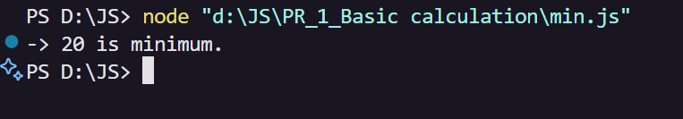
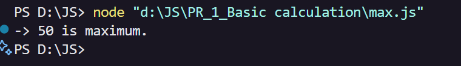
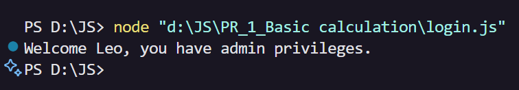
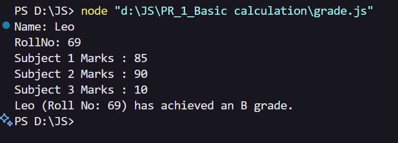
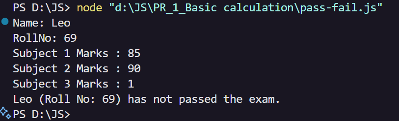
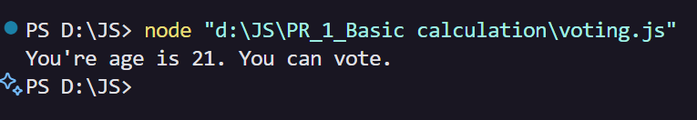
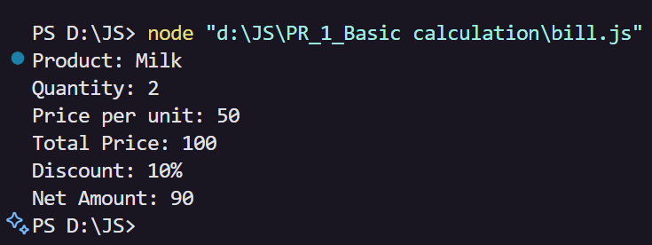
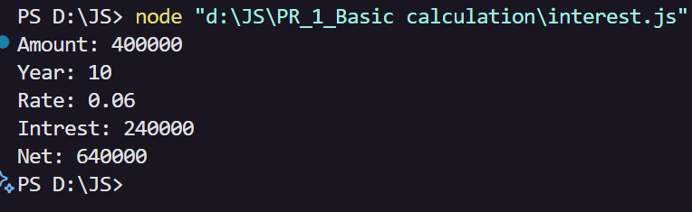

# 🧮 JavaScript Basic Calculations Project

Welcome to the **JavaScript Basic Calculations** project!  
This repository contains simple JS programs that demonstrate foundational programming concepts through practical calculation and logic tasks.

---

## 📋 Tasks Overview

| #  | Task Description             | Output Screenshot                |
|----|-----------------------------|----------------------------------|
| 1  | **Find Minimum Value**       |        |
| 2  | **Find Maximum Value**       |        |
| 3  | **Check User Role**          |         |
| 4  | **Calculate Grade**          |        |
| 5  | **Check Pass/Fail Status**   |  |
| 6  | **Voting Eligibility Check** |      |
| 7  | **Calculate Bill**           |          |
| 8  | **Find Interest**            |  |

---

## 👤 Author

*Anashali Saiyed