# 📝 JavaScript Conditional Statements Project

Welcome to the **JavaScript Conditional Statements** project!  
This repository contains 20 practical JS programs that demonstrate the use of conditional logic in real-world scenarios. Each program is accompanied by a sample output screenshot.

---

## 📚 Program List & Outputs

| #  | Program Description                                 | Output Screenshot         |
|----|-----------------------------------------------------|--------------------------|
| 1  | Check if number is positive, negative, or zero      | 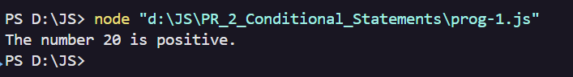           |
| 2  | Grade classification                                | 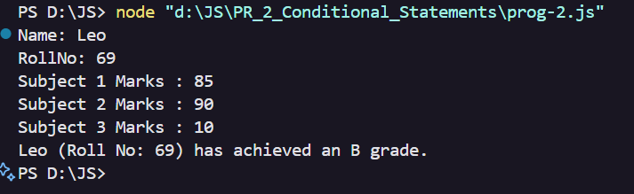           |
| 3  | Check day of the week (1–7)                         | 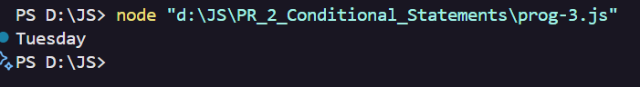           |
| 4  | Even or Odd                                         | 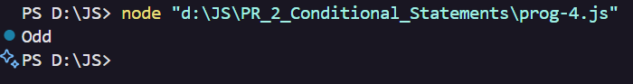           |
| 5  | Check eligibility to vote                           | 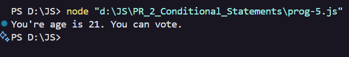           |
| 6  | Check number is 1, 2 or 3                           | 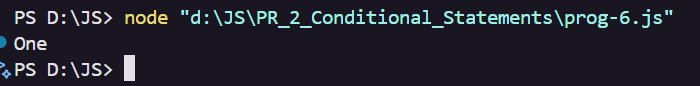           |
| 7  | Temperature condition                               | 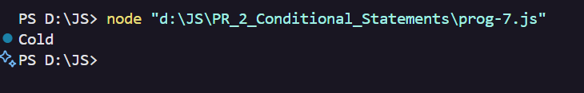           |
| 8  | Compare two numbers                                 | 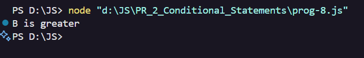           |
| 9  | Speed check                                         | 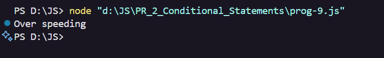           |
| 10 | Login authentication (role-based)                   | 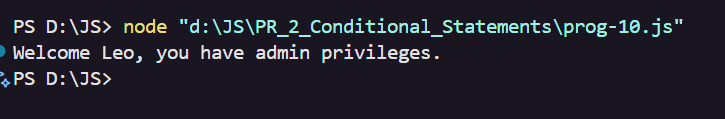         |
| 11 | Triangle type based on sides                        | 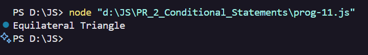         |
| 12 | Largest among three                                 | 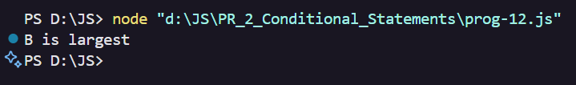         |
| 13 | Check leap year                                     | 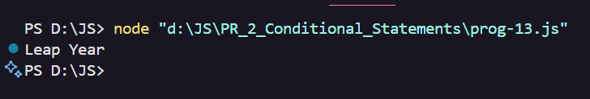         |
| 14 | Menu-driven choice                                  | 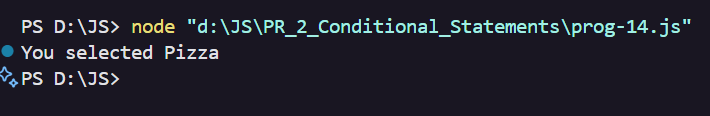         |
| 15 | BMI classification                                  | 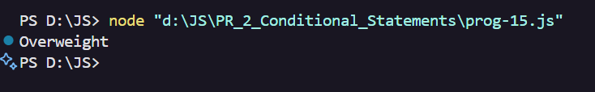         |
| 16 | Electricity bill slab                               | 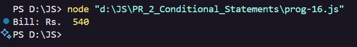         |
| 17 | Age group categorization                            | 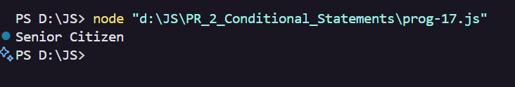         |
| 18 | Parking fee system                                  | 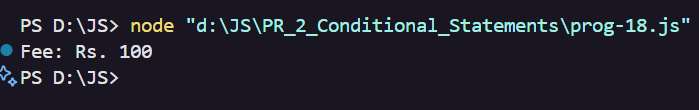         |
| 19 | Salary slip                                         | 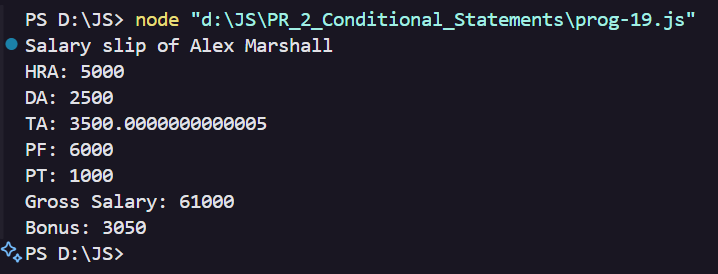         |
| 20 | Simple Interest                                     | 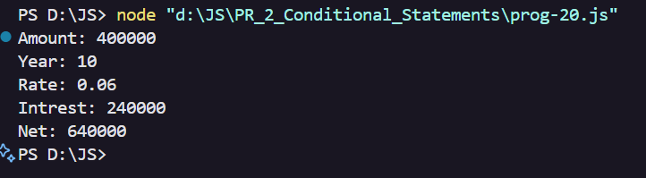         |

---

## 🚀 How to Run

1. **Clone or Download** this repository.
2. Open the `PR_2_Conditional_Statements` folder.
3. Run any program using Node.js:
   ```sh
   node <filename>.js
   ```
   Replace `<filename>` with the desired JS file (e.g., `prog1.js`).

---

## ✨ Screenshots

All screenshots are available in the [`SS`](SS) folder for quick reference.

---

## 👤 Author

*Anashali Saiyed*

---