# 🔁 JavaScript Repetition Logic Project

Welcome to the **JavaScript Repetition Logic** project!  
This repository features 20 practical JS programs that demonstrate the use of loops (`for`, `while`, and `do...while`) for solving common computational problems. Each program is paired with a sample output screenshot for clarity.

---

## 📋 Program List & Outputs

| #  | Program Description                                                        | Output Screenshot      |
|----|---------------------------------------------------------------------------|-----------------------|
| 1  | Sum of numbers from 1 to 10 (for loop)                                     | 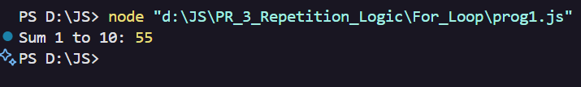        |
| 2  | Sum of even numbers from 1 to 20 (for loop)                                | 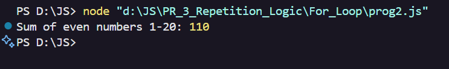        |
| 3  | Sum of odd numbers from 1 to 20 (while loop)                               | 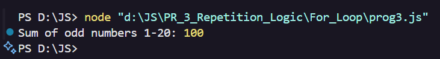        |
| 4  | Sum of multiples of 5 from 1 to 50 (for loop)                              | 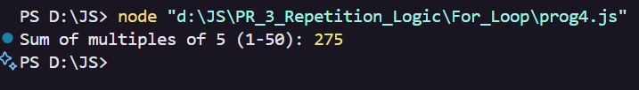        |
| 5  | Sum of squares from 1 to 10 (for loop)                                     | 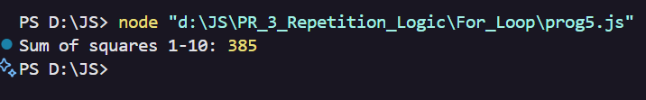        |
| 6  | Sum of digits of a number (e.g., 12345)                                    | 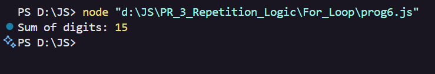        |
| 7  | Sum of numbers divisible by both 3 and 7 (1–100)                           | 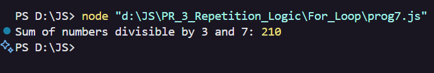        |
| 8  | Sum of all prime numbers from 1 to 50                                      | 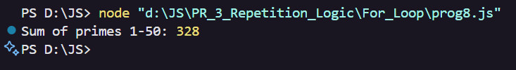        |
| 9  | Sum of first 10 natural numbers using while                                | 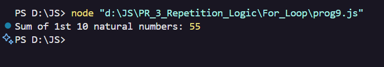        |
| 10 | Sum of even numbers between 50 and 100                                     | 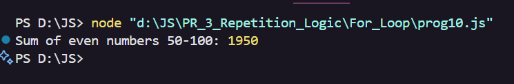      |
| 11 | Sum of odd numbers between 100 and 150 using while                         | 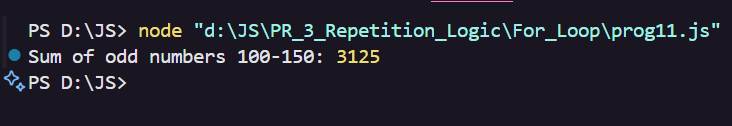      |
| 12 | Sum of digits of all numbers from 1 to 50                                  | 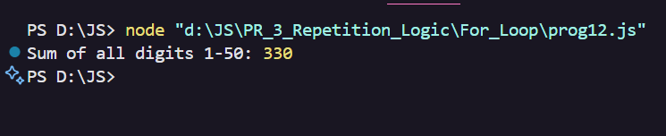      |
| 13 | Sum of numbers not divisible by 3 (1–30)                                   | 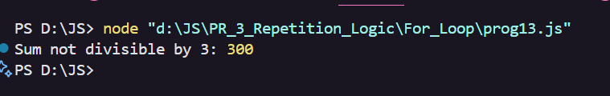      |
| 14 | Sum of factorial numbers 1! + 2! + 3! + ... + 5!                           | 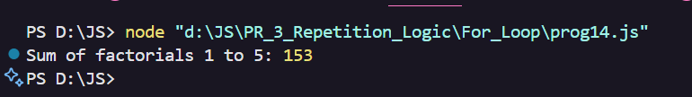      |
| 15 | Sum of all numbers ending with digit 7 (1–100)                             | 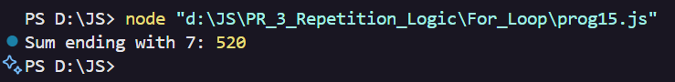      |
| 16 | Sum of numbers from 1 to n until sum > 50 (while)                          | 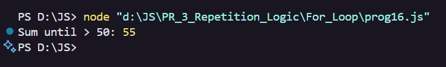      |
| 17 | Sum of numbers between 10 and 30 not divisible by 2 or 3                   | 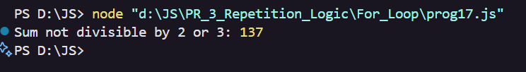      |
| 18 | Sum of cubes of 1 to 5                                                     | 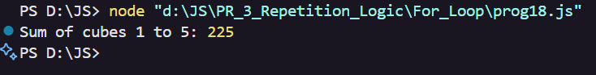      |
| 19 | Sum of numbers divisible by 4 but not 8 (1–50)                             | 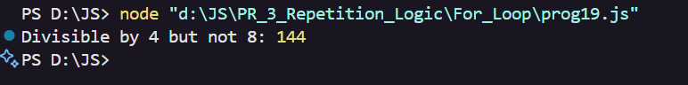      |
| 20 | Sum of alternate numbers (1, 3, 5... to 19) using while                    | 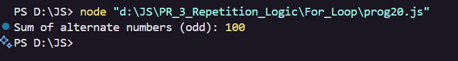      |

---

## 🚀 How to Run

1. **Clone or Download** this repository.
2. Open the `PR_3_Repetition_Logic` folder.
3. Run any program using Node.js:
   ```sh
   node <filename>.js
   ```
   Replace `<filename>` with the desired JS file (e.g., `prog1.js`).

---

## ✨ Screenshots

All screenshots are available in the [`SS`](SS) folder for quick reference.

---

## 👤 Author

*Anashali Saiyed*

---