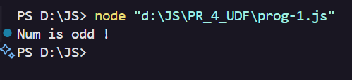
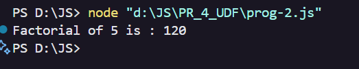
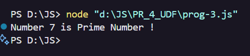
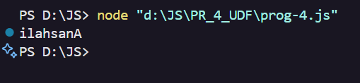
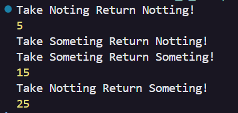
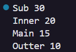

# 🛠️ JavaScript User Defined Functions (UDF) Project

Welcome to the **JavaScript UDF Project**!  
This repository contains a collection of programs demonstrating user-defined functions in JavaScript, each with a sample output screenshot.

---

## 📋 Program List & Outputs

| #  | Program Description                       | Output Screenshot      |
|----|-------------------------------------------|-----------------------|
| 1  | Check if Number is Even or Odd            |  |
| 2  | Find Factorial of a Number                | |
| 3  | Check if Number is Prime                  |     |
| 4  | Reverse String                            |   |
| 5  | Type of Functions                         |     |
| 6  | Nested and Closure Functions              |    |

---

## 🚀 How to Run

1. **Clone or Download** this repository.
2. Open the `PR_4_UDF` folder.
3. Run any program using Node.js:
   ```sh
   node <filename>.js
   ```
   Replace `<filename>` with the desired JS file (e.g., `prog-1.js`).

---

## ✨ Screenshots

All screenshots are available in the [`SS`](SS) folder for quick reference.

---

## 👤 Author

*Anashali*

---