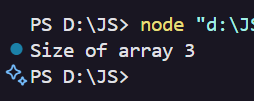
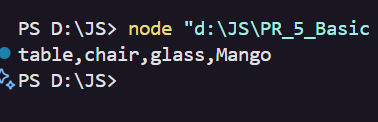
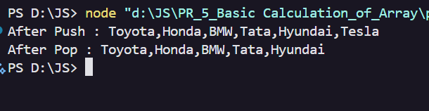
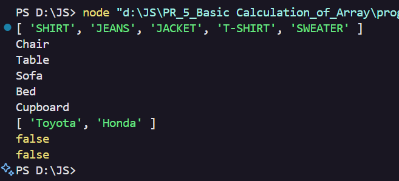
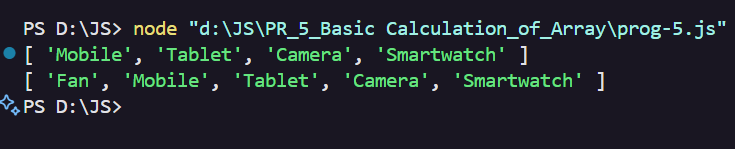
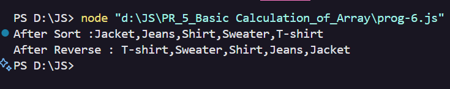
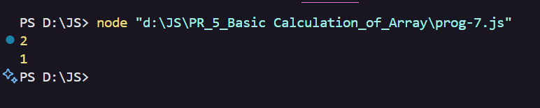
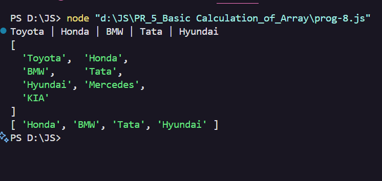

# 📚 JavaScript Array Methods Showcase

Welcome to the **JavaScript Array Methods** project!  
This repository demonstrates the most commonly used array methods in JavaScript, each illustrated with a sample output screenshot.

---

## 🛠️ Array Methods & Outputs

| #  | Array Method           | Description                                         | Output Screenshot      |
|----|------------------------|-----------------------------------------------------|-----------------------|
| 1  | `length`               | Get the number of elements in the array             |    |
| 2  | `toString()`           | Convert the array to a string                       |  |
| 3  | `push()`, `pop()`      | Add to end (`push`), remove from end (`pop`)        |  |
| 4  | **Iterative Methods**      | Use `forEach`, `map`, `filter`, etc. to process arrays |  |
| 5  | `shift()`, `unshift()` | Remove from start (`shift`), add to start (`unshift`)|  |
| 6  | `sort()`, `reverse()`  | Sort or reverse the array order                     |  |
| 7  | `indexOf()`            | Find the index of a specific element                |   |
| 8  | `concat()`             | Merge two or more arrays                            |    |

---

## 👤 Author

*Anashali*